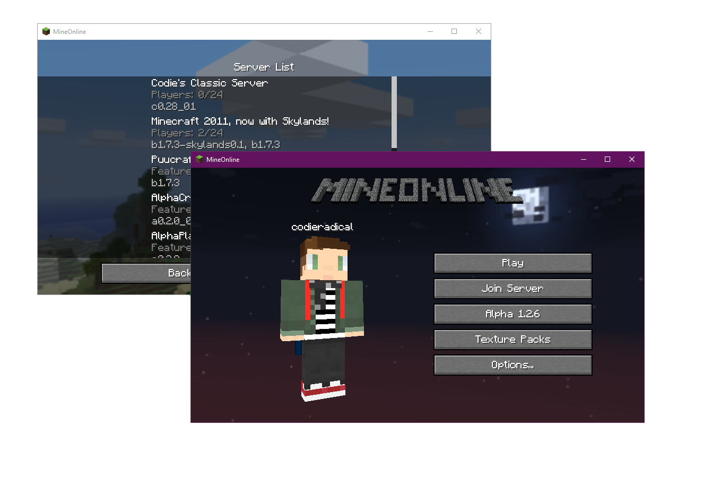

Launch old versions of minecraft just as you remembered them.

## What is MineOnline?
MineOnline is a launcher Minecraft capable of running web applets without a browser, and redirecting web requests to a new API.

For example, if you wanted to play classic right now, you'd have no way to launch it without a lot of outdated vulnerable software and luck. And even if you pulled it off, you'd be running a stipped down version of the game, with no skins, no server authentication and no online map saving. MineOnline fixes this.

The program can also run regular desktop versions of the game, and even old launchers.

[Download](https://github.com/codieradical/MineOnline/releases)

## Features
These are features MineOnline will bring to Minecraft.

- Launcher Authentication and Updates

- Server Authentication (online-mode)

- Skins and Cloaks

- Server List

- Online World Saves

- Resource Files (Sounds)

- Resizable & Fullscreenable Applets

- Screenshots (F2)

- Minecraft Realms (for all release versions)



## Launching Servers
If you'd like to launch a server to authenticate using a different API, you can do so with a simple tweak to the typical launch command.
Add `-cp <MineOnline.jar path> gg.codie.mineonline.Server <server jar path>` after "java". Eg.

```java -Xmx1024M -Xms1024M -jar minecraft_server.jar nogui```

becomes

```java -cp MineOnline.jar gg.codie.mineonline.Server minecraft_server.jar -Xmx1024M -Xms1024M -jar minecraft_server.jar nogui```

If you don't want your server to appear on the list, set `dont-list: true` in `server.properties`.

You can optionally provide a "serverlist-ip" and or "serverlist-port" in your server.properties, if you'd like a different IP/hostname/port to be listed.

## For Modders
You can add custom version information to the launcher by creating a version info file at `.minecraft\mineonline\custom-versions\`.
The file should be in a directory named client or server, and it's name should contain the version name and md5.
For example:
`.minecraft\mineonline\custom-versions\client\Skylands 0.1 F8F78A4ED4033547CC1EA28C776DA7AE.json`
This file should contain an array of JSON versions, like this:

```json
{ 
  "name": "Skylands 0.1", 
  "md5": "F8F78A4ED4033547CC1EA28C776DA7AE", 
  "type": "client",
  "baseVersion": "b1.7.3",
  "info": "Beta 1.7.3 mod",
  "legacy": true
}
```

Legacy is true for any pre-1.6 minecraft version.
For 1.6 and above, libraries should be provided. Examples can be found [here](https://github.com/codieradical/MineOnline/blob/master/res/versions/client/).

If you would like a version to be added to the main list, contact me (Codie).

## For Developers
As per the license you are welcome to use the launcher code under non-commercial conditions.

Note that the graphics code is VERY rough. I've never used LWJGL before, I've also never written game engine code on that level.
I might tidy things up in future, if I get time.

The GUI and menu code shall not be used for 'clone' projects (for instance, copying my API and pointing the launcher to it).

I also request that forks remain up to date for security.


## Credit

- I wouldn't have been able to make this LWJGL UI without [ThinMatrix](https://twitter.com/thinmatrix)'s LWJGL 2 tutorial.
